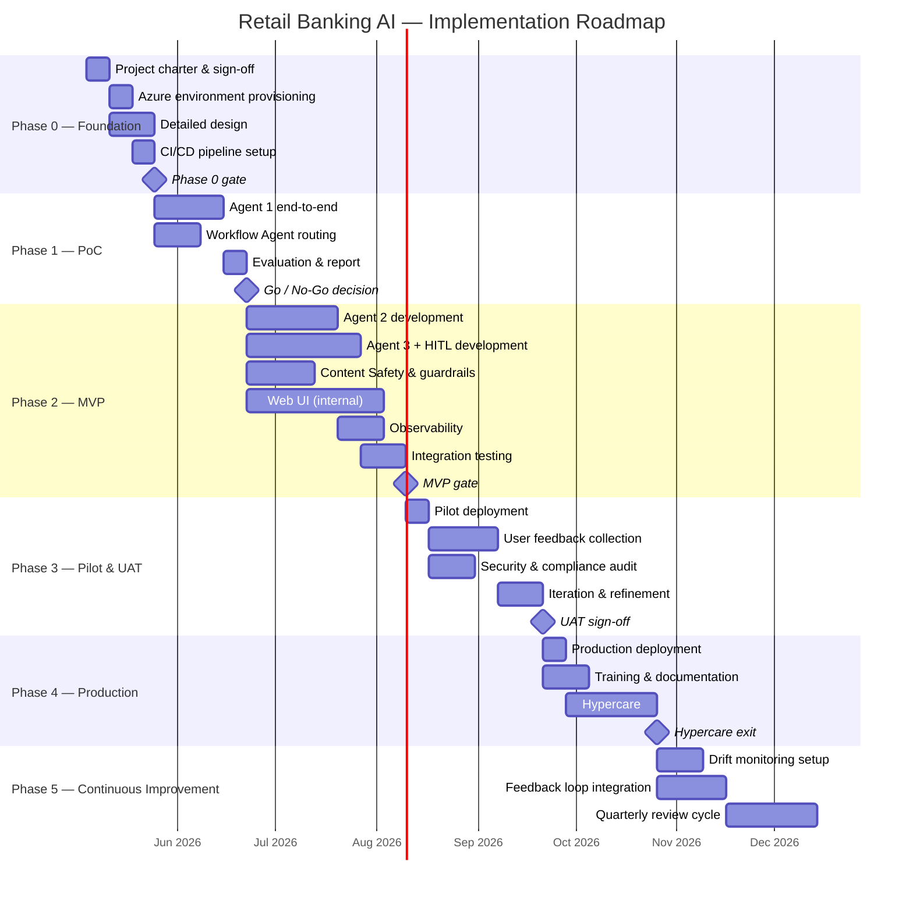

# Implementation Roadmap

> **Status:** Draft — high-level structure  
> **Language:** English  
> **Synchronized with:** `implementation_roadmap_PL.md`

---

## 1. Executive Summary

A concise overview of the implementation plan for the Retail Banking AI multi-agent solution on Microsoft Foundry (Azure AI Foundry). This section frames the overall approach, key milestones, resource commitments, and expected return on investment — enabling executive stakeholders to understand the scope, pace, and financial profile of the initiative at a glance.

---

## 2. Implementation Phases

The rollout is structured into distinct phases, each with clear objectives, deliverables, and exit criteria. This staged approach reduces risk by validating assumptions early and allowing course corrections before committing to full-scale deployment.

### 2.1 Phase 0 — Foundation & Planning

Establishes the organisational, technical, and governance foundations required before any development work begins. This phase ensures that infrastructure is provisioned, the team is staffed, and the project backlog is defined.

#### 2.1.1 Objectives

- Finalise project charter and stakeholder sign-off.
- Provision Azure AI Foundry resource, Foundry Project, and supporting Azure services.
- Onboard team members; assign roles and responsibilities.
- Establish CI/CD pipelines, environments (dev / staging / prod), and observability baseline.
- Complete detailed design artefacts (data pipeline specs, prompt templates, integration contracts).

#### 2.1.2 Key Deliverables

| # | Deliverable | Owner | Exit Criterion |
|---|-------------|-------|----------------|
| 1 | Signed project charter | Project Sponsor | Approved by steering committee |
| 2 | Azure environment provisioned (IaC) | Platform Engineer | All foundry resources accessible; RBAC configured |
| 3 | Detailed design document | AI Architect | Peer-reviewed and baselined |
| 4 | CI/CD pipeline (skeleton) | DevOps Engineer | Successful build & deploy to dev |
| 5 | Risk register v1 | Project Manager | Reviewed in kick-off meeting |

#### 2.1.3 Duration

_Estimated: 3–4 weeks_

### 2.2 Phase 1 — Proof of Concept (PoC)

Validates the core technical hypotheses defined in the _AI Solution Concept and Design_ document. The PoC focuses on the highest-risk agent (to be determined during planning) and demonstrates end-to-end feasibility within a controlled scope.

#### 2.2.1 Objectives

- Implement one agent end-to-end (e.g., Agent 1 — Product Catalogue) with retrieval, generation, and evaluation.
- Verify the Workflow Agent's routing logic with at least two agents.
- Benchmark latency, accuracy, and cost against PoC success metrics.
- Obtain stakeholder go / no-go decision.

#### 2.2.2 Key Deliverables

| # | Deliverable | Owner | Exit Criterion |
|---|-------------|-------|----------------|
| 1 | Working PoC agent (Agent 1 or highest-risk agent) | ML Engineer | Passes success metrics defined in Concept doc §5.2 |
| 2 | Workflow Agent — basic routing | AI Developer | Routes to ≥ 2 agents correctly |
| 3 | Evaluation report | Data Scientist | Metrics documented; recommendation issued |
| 4 | Go / No-Go decision | Steering Committee | Formal sign-off |

#### 2.2.3 Duration

_Estimated: 4–6 weeks_

### 2.3 Phase 2 — MVP Development

Builds the Minimum Viable Product encompassing all three specialised agents, the orchestrator, security guardrails, and a basic front-end interface. The MVP targets a limited user group for early feedback.

#### 2.3.1 Objectives

- Develop and integrate all three Prompt Agents (Product Catalogue, Hyper-Personalisation, Credit Application).
- Implement Content Safety and Guardrails layer.
- Connect MCP servers to CRM, transaction, and product data sources.
- Integrate Document Intelligence for credit application OCR.
- Deliver a functional UI (web app) for internal pilot users.
- Establish observability (tracing, App Insights dashboards).

#### 2.3.2 Key Deliverables

| # | Deliverable | Owner | Exit Criterion |
|---|-------------|-------|----------------|
| 1 | Agent 1 — Product Catalogue (production-ready) | ML Engineer | Accuracy ≥ target; latency P95 ≤ 500 ms |
| 2 | Agent 2 — Hyper-Personalisation | ML Engineer | Cross-sell relevance score ≥ target |
| 3 | Agent 3 — Credit Application + HITL flow | ML Engineer | End-to-end flow with human review functional |
| 4 | Workflow Agent — full routing & fallback | AI Developer | All agents reachable; graceful error handling |
| 5 | Content Safety layer | Security Engineer | Prompt-injection and PII filters active |
| 6 | Web UI (internal pilot) | Front-End Developer | Usable by pilot group; basic UX validated |
| 7 | Observability dashboards | DevOps Engineer | Traces and metrics visible in App Insights |

#### 2.3.3 Duration

_Estimated: 8–12 weeks_

### 2.4 Phase 3 — Pilot & User Acceptance Testing (UAT)

Deploys the MVP to a controlled group of real users (bank employees and/or selected clients) to collect qualitative feedback, validate business value, and identify production-readiness gaps.

#### 2.4.1 Objectives

- Onboard pilot users (internal employees first, then selected clients).
- Collect structured feedback via surveys, interviews, and usage analytics.
- Run A/B tests comparing AI-assisted vs. current processes where feasible.
- Perform security penetration testing and compliance audit.
- Iterate on prompt engineering, guardrails, and UX based on feedback.

#### 2.4.2 Key Deliverables

| # | Deliverable | Owner | Exit Criterion |
|---|-------------|-------|----------------|
| 1 | Pilot deployment (staging → pilot env) | DevOps Engineer | Stable for ≥ 2 weeks with pilot users |
| 2 | User feedback report | Product Owner | ≥ 80 % positive satisfaction; issues triaged |
| 3 | Security & compliance audit report | Security Engineer | No critical / high findings open |
| 4 | Refined prompts and guardrails v2 | ML Engineer | Improved metrics post-iteration |
| 5 | UAT sign-off | Business Stakeholders | Formal acceptance |

#### 2.4.3 Duration

_Estimated: 4–6 weeks_

### 2.5 Phase 4 — Production Rollout

Promotes the validated solution to the production environment, enabling access for all intended users. This phase includes go-live preparation, data migration (if applicable), training, and hypercare support.

#### 2.5.1 Objectives

- Execute production deployment with blue-green or canary strategy.
- Migrate or cut-over data connections from pilot to production sources.
- Deliver end-user training and internal documentation.
- Establish on-call support rotation and escalation procedures.
- Monitor KPIs intensively during the hypercare period.

#### 2.5.2 Key Deliverables

| # | Deliverable | Owner | Exit Criterion |
|---|-------------|-------|----------------|
| 1 | Production deployment | DevOps Engineer | Zero-downtime deployment verified |
| 2 | Data connection cut-over | Data Engineer | All agents reading from production sources |
| 3 | User training materials & sessions | Product Owner | Training delivered to ≥ 90 % of target users |
| 4 | Runbook & on-call schedule | DevOps / SRE | Documented and rehearsed |
| 5 | Hypercare exit report | Project Manager | KPIs stable for ≥ 2 weeks; no P1/P2 incidents |

#### 2.5.3 Duration

_Estimated: 2–4 weeks (plus 2–4 weeks hypercare)_

### 2.6 Phase 5 — Continuous Improvement & Scaling

Post-launch phase focused on monitoring model drift, expanding to new use cases, optimising cost, and evolving the solution based on production data and user feedback.

#### 2.6.1 Objectives

- Establish automated model evaluation and drift detection.
- Implement feedback loops (thumbs-up/down, HITL corrections) to improve agent quality.
- Evaluate and onboard additional agents or capabilities.
- Optimise token consumption, caching, and infrastructure costs.
- Periodic compliance re-assessment.

#### 2.6.2 Key Deliverables

| # | Deliverable | Owner | Exit Criterion |
|---|-------------|-------|----------------|
| 1 | Drift monitoring pipeline | Data Scientist | Automated alerts on metric degradation |
| 2 | Feedback loop integration | ML Engineer | User corrections flow into evaluation datasets |
| 3 | Cost optimisation report (quarterly) | Cloud Architect | Actionable recommendations; TCO trending down |
| 4 | Roadmap update for next capabilities | Product Owner | Prioritised backlog for next quarter |

#### 2.6.3 Duration

_Ongoing — review cadence: quarterly_

---

## 3. Master Schedule

A consolidated timeline showing all phases, milestones, and key decision gates. The schedule assumes sequential phases with defined overlap where parallelism is possible.

### 3.1 Gantt Chart (High-Level)

### 3.2 Critical Path

Identifies the sequence of dependent tasks that determines the minimum project duration. Any delay on the critical path directly impacts the go-live date.

| Step | Dependency | Critical? |
|------|-----------|-----------|
| Detailed design | Project charter signed | Yes |
| Agent 1 PoC | Detailed design complete | Yes |
| Go / No-Go decision | PoC evaluation report | Yes |
| Agent 3 + HITL | Go / No-Go passed | Yes |
| Integration testing | All agents developed | Yes |
| UAT sign-off | Pilot feedback + security audit | Yes |
| Production deployment | UAT sign-off | Yes |

### 3.3 Key Milestones Summary

| # | Milestone | Target Date | Decision Maker |
|---|-----------|-------------|----------------|
| M1 | Phase 0 gate — foundations ready | End of Week 4 | Project Manager |
| M2 | PoC Go / No-Go | End of Week 10 | Steering Committee |
| M3 | MVP gate — all agents integrated | End of Week 22 | Technical Lead + PO |
| M4 | UAT sign-off | End of Week 28 | Business Stakeholders |
| M5 | Production go-live | End of Week 30 | Steering Committee |
| M6 | Hypercare exit | End of Week 34 | Project Manager |

---

## 4. Resources

This section defines the team composition, skill requirements, and external dependencies needed to execute the roadmap successfully.

### 4.1 Core Team Roles and Responsibilities

| Role | Headcount | Responsibility | Phase(s) Active |
|------|-----------|---------------|-----------------|
| Project Manager / Scrum Master | 1 | Planning, risk management, stakeholder communication | 0–5 |
| AI / ML Architect | 1 | Architecture decisions, paradigm selection, technical leadership | 0–3 |
| ML Engineer | 2 | Agent development, prompt engineering, model fine-tuning, evaluation | 1–5 |
| Data Engineer | 1 | Data pipelines, MCP server development, data quality | 0–4 |
| Platform / DevOps Engineer | 1 | Azure provisioning, CI/CD, IaC, monitoring | 0–5 |
| Front-End Developer | 1 | Web UI, UX design and iteration | 2–4 |
| Security / Compliance Engineer | 0.5 | Content Safety, PII handling, audit, penetration testing | 0–4 |
| Product Owner | 1 | Backlog prioritisation, stakeholder alignment, UAT coordination | 0–5 |
| Business Analyst / Domain Expert | 0.5 | Requirements validation, credit rules, product catalogue accuracy | 0–3 |

### 4.2 Skill Matrix and Training Needs

| Skill Area | Required Proficiency | Current Gap | Training / Hiring Plan |
|------------|---------------------|-------------|----------------------|
| Azure AI Foundry (Agent Service, Evaluations) | Advanced | _To be assessed_ | Microsoft-led workshop; hands-on PoC |
| Prompt Engineering (GPT-4o / GPT-4.1) | Advanced | _To be assessed_ | Internal knowledge sharing; online courses |
| MCP Server Development | Intermediate | _To be assessed_ | Documentation study; pair programming |
| Azure AI Search (vector + hybrid) | Intermediate | _To be assessed_ | Microsoft Learn path |
| Document Intelligence (OCR) | Basic–Intermediate | _To be assessed_ | Vendor tutorial; PoC experimentation |
| Responsible AI & Content Safety | Intermediate | _To be assessed_ | Microsoft Responsible AI training |

### 4.3 External Dependencies and Vendors

| Dependency | Provider | Nature | Risk if Delayed |
|------------|----------|--------|-----------------|
| Azure AI Foundry access & quotas | Microsoft | Platform | Blocks all agent development |
| GPT-4o / GPT-4.1 model availability | Azure OpenAI | Model inference | Blocks agent quality targets |
| CRM & transaction data access | Internal IT / Data team | Data source | Blocks Agent 2 development |
| Credit rules engine specification | Risk / Compliance dept. | Business rules | Blocks Agent 3 development |
| Production environment approval | IT Security / Change Board | Governance | Blocks Phase 4 deployment |

### 4.4 Infrastructure and Compute Requirements

| Resource | Service / SKU | Phase Needed | Estimated Monthly Cost |
|----------|--------------|-------------|----------------------|
| Azure AI Foundry Project | Standard tier | 0–5 | _See §5 for cost model_ |
| Azure OpenAI (GPT-4o) | Pay-as-you-go tokens | 1–5 | _Variable — see §5_ |
| Azure AI Search | Standard S1 | 1–5 | _See §5_ |
| Azure App Service / Container Apps | B2+ / P1v3 | 2–5 | _See §5_ |
| Azure Document Intelligence | S0 | 2–5 | _See §5_ |
| Azure Monitor / App Insights | Pay-as-you-go | 0–5 | _See §5_ |
| Dev / Staging / Prod environments | Separate resource groups | 0–5 | _See §5_ |

---

## 5. Budget, TCO, and ROI

This section provides the financial analysis for the initiative, covering upfront investment, ongoing operational costs, and the expected return over a defined time horizon.

### 5.1 Cost Model Assumptions

| Assumption | Value | Rationale |
|------------|-------|-----------|
| Planning horizon | 3 years | Standard enterprise project evaluation period |
| Currency | EUR (or PLN — _to be confirmed_) | Primary operating currency |
| Token consumption estimate | _To be modelled during PoC_ | Based on projected query volume and average token count |
| User base (Year 1 → Year 3) | _TBD_ | Phased rollout; pilot → department → bank-wide |
| Discount rate for NPV | 8 % | Corporate WACC or hurdle rate |

### 5.2 Total Cost of Ownership (TCO)

#### 5.2.1 One-Time Costs (CAPEX / Initial Investment)

| Category | Item | Estimated Cost | Notes |
|----------|------|---------------|-------|
| **People** | Team ramp-up & training | _TBD_ | Workshops, certifications |
| **People** | External consulting (if any) | _TBD_ | Architecture review, security audit |
| **Platform** | Azure environment setup (IaC) | _TBD_ | One-time provisioning effort |
| **Platform** | CI/CD pipeline build-out | _TBD_ | DevOps tooling, pipeline design |
| **Development** | PoC development | _TBD_ | Phase 1 effort |
| **Development** | MVP development | _TBD_ | Phase 2 effort |
| **Development** | UI/UX design & development | _TBD_ | Front-end build |
| **Compliance** | Security audit & pen-test | _TBD_ | External assessor |
| | **Total One-Time** | **_TBD_** | |

#### 5.2.2 Recurring Costs (OPEX / Annual)

| Category | Item | Year 1 | Year 2 | Year 3 | Notes |
|----------|------|--------|--------|--------|-------|
| **Azure Compute** | AI Foundry + App Service | _TBD_ | _TBD_ | _TBD_ | Scales with usage |
| **Azure AI** | OpenAI token consumption | _TBD_ | _TBD_ | _TBD_ | Largest variable cost |
| **Azure AI** | AI Search (index hosting) | _TBD_ | _TBD_ | _TBD_ | Fixed per SKU |
| **Azure AI** | Document Intelligence | _TBD_ | _TBD_ | _TBD_ | Per-page pricing |
| **Azure Infra** | Monitoring, logging, storage | _TBD_ | _TBD_ | _TBD_ | |
| **People** | Ongoing operations & support | _TBD_ | _TBD_ | _TBD_ | 1–2 FTE post-launch |
| **People** | Continuous improvement / ML Ops | _TBD_ | _TBD_ | _TBD_ | Prompt tuning, drift response |
| **Licensing** | Third-party tools (if any) | _TBD_ | _TBD_ | _TBD_ | |
| | **Total Annual OPEX** | **_TBD_** | **_TBD_** | **_TBD_** | |

#### 5.2.3 TCO Summary (3-Year)

| Component | Year 0 (Setup) | Year 1 | Year 2 | Year 3 | 3-Year Total |
|-----------|----------------|--------|--------|--------|-------------|
| One-Time Costs | _TBD_ | — | — | — | _TBD_ |
| Recurring OPEX | — | _TBD_ | _TBD_ | _TBD_ | _TBD_ |
| **Total** | **_TBD_** | **_TBD_** | **_TBD_** | **_TBD_** | **_TBD_** |

### 5.3 Benefits and Value Drivers

Quantified benefits that the AI solution is expected to generate. Each benefit is linked to a specific agent or capability, making the value attribution traceable.

| # | Benefit | Agent / Capability | Metric | Estimated Annual Value | Assumptions |
|---|---------|-------------------|--------|----------------------|-------------|
| B1 | Reduced product inquiry handling time | Agent 1 — Product Catalogue | Avg. handling time reduction | _TBD_ | _TBD_ |
| B2 | Increased cross-sell conversion | Agent 2 — Hyper-Personalisation | Uplift in conversion rate | _TBD_ | _TBD_ |
| B3 | Faster credit application processing | Agent 3 — Credit Application | Cycle time reduction | _TBD_ | _TBD_ |
| B4 | Cost avoidance — manual document review | Agent 3 — OCR + Rule Engine | FTE hours saved | _TBD_ | _TBD_ |
| B5 | Improved customer satisfaction (NPS) | All agents | NPS uplift | _TBD_ | Indirect — harder to quantify |
| B6 | Regulatory risk reduction | Content Safety + Guardrails | Incident avoidance value | _TBD_ | Based on industry benchmarks |

### 5.4 Return on Investment (ROI)

#### 5.4.1 ROI Calculation

$$
\text{ROI} = \frac{\text{Net Benefits (3-year)} - \text{TCO (3-year)}}{\text{TCO (3-year)}} \times 100\%
$$

| Scenario | 3-Year TCO | 3-Year Benefits | Net Value | ROI |
|----------|-----------|----------------|-----------|-----|
| Conservative | _TBD_ | _TBD_ | _TBD_ | _TBD_ |
| Base case | _TBD_ | _TBD_ | _TBD_ | _TBD_ |
| Optimistic | _TBD_ | _TBD_ | _TBD_ | _TBD_ |

#### 5.4.2 Payback Period

The expected number of months from go-live until cumulative benefits exceed cumulative costs.

| Scenario | Payback Period |
|----------|---------------|
| Conservative | _TBD_ months |
| Base case | _TBD_ months |
| Optimistic | _TBD_ months |

#### 5.4.3 Net Present Value (NPV)

$$
\text{NPV} = \sum_{t=0}^{3} \frac{CF_t}{(1 + r)^t}
$$

where $CF_t$ = net cash flow in year $t$, and $r$ = discount rate.

| Scenario | NPV |
|----------|-----|
| Conservative | _TBD_ |
| Base case | _TBD_ |
| Optimistic | _TBD_ |

### 5.5 Sensitivity Analysis

Identifies which variables have the greatest impact on ROI and NPV, helping stakeholders understand the financial risk profile.

| Variable | Range Tested | Impact on ROI | Impact on NPV |
|----------|-------------|---------------|---------------|
| Token consumption cost (±30 %) | _TBD_ | _TBD_ | _TBD_ |
| User adoption rate (±20 %) | _TBD_ | _TBD_ | _TBD_ |
| Cross-sell conversion uplift (±50 %) | _TBD_ | _TBD_ | _TBD_ |
| Headcount cost variance (±15 %) | _TBD_ | _TBD_ | _TBD_ |

---

## 6. Governance and Risk Management

### 6.1 Project Governance Structure

| Forum | Frequency | Participants | Purpose |
|-------|-----------|-------------|---------|
| Daily Stand-up | Daily | Core team | Progress, blockers, coordination |
| Sprint Review / Demo | Bi-weekly | Core team + PO | Increment review, feedback |
| Steering Committee | Monthly | Sponsors, PO, PM, Architect | Strategic decisions, budget, escalations |
| Architecture Review Board | As needed | Architect, Security, DevOps | Design decisions, non-functional requirements |

### 6.2 Change Management

Describes the process for handling scope changes, budget adjustments, and timeline shifts — including who can approve changes at each tier.

### 6.3 Key Risks and Mitigations (Roadmap-Specific)

| # | Risk | Impact | Probability | Mitigation |
|---|------|--------|-------------|------------|
| R1 | Azure AI Foundry quota delays | High | Medium | Early quota request; fallback to alternative region |
| R2 | Data access blocked by internal IT | High | Medium | Engage data governance team in Phase 0; formal data-sharing agreement |
| R3 | PoC fails to meet success metrics | High | Low–Medium | Iterate prompts/retrieval; consider paradigm pivot (see Concept doc §2) |
| R4 | Key team member departure | Medium | Low | Cross-training; documented knowledge base |
| R5 | Token costs exceed budget | Medium | Medium | Implement token budgets, caching, model-size optimisation (GPT-4.1-mini) |
| R6 | Regulatory requirements change mid-project | Medium | Low | Regular compliance check-ins; modular architecture allows adaptation |
| R7 | Low user adoption post-launch | High | Low–Medium | Early pilot involvement; change management; UX iteration |

---

## 7. Success Criteria and KPIs

Defines how the overall implementation will be judged successful, distinct from individual PoC metrics.

| KPI | Target | Measurement Method | Review Cadence |
|-----|--------|-------------------|----------------|
| On-time delivery (milestones hit) | ≥ 80 % of milestones on schedule | Gantt vs. actual | Monthly |
| Budget variance | ≤ 10 % over budget | Actuals vs. plan | Monthly |
| User satisfaction (pilot) | ≥ 4.0 / 5.0 | Survey | End of Phase 3 |
| Agent accuracy (production) | Per Concept doc §5.2 targets | Automated evaluation | Weekly |
| System availability | ≥ 99.5 % | Azure Monitor | Monthly |
| Mean time to resolution (P1/P2) | ≤ 4 hours | Incident tracking | Monthly |
| ROI realisation (Year 1) | ≥ Base-case forecast | Finance report | Annually |

---

## 8. Next Steps

Immediate actions to initiate the roadmap execution.

### 8.1 Immediate Actions

1. Obtain steering committee approval for this roadmap.
2. Confirm team staffing and onboarding dates.
3. Submit Azure AI Foundry quota and access requests.
4. Schedule detailed design workshops (Phase 0 kick-off).
5. Establish the project backlog in the chosen project management tool.

### 8.2 Open Decisions

| # | Decision | Required By | Decision Maker | Deadline |
|---|----------|------------|----------------|----------|
| D1 | Final currency for budget (EUR vs. PLN) | Phase 0 | Finance / Sponsor | _TBD_ |
| D2 | Build vs. buy for front-end UI | Phase 0 | Architect + PO | _TBD_ |
| D3 | Agent 1 retrieval strategy (MCP vs. File Search) | Phase 1 | Architect | End of PoC |
| D4 | Production hosting model (App Service vs. Container Apps) | Phase 2 | Platform Engineer | _TBD_ |

---

_Document version: 0.1 — high-level structure_
