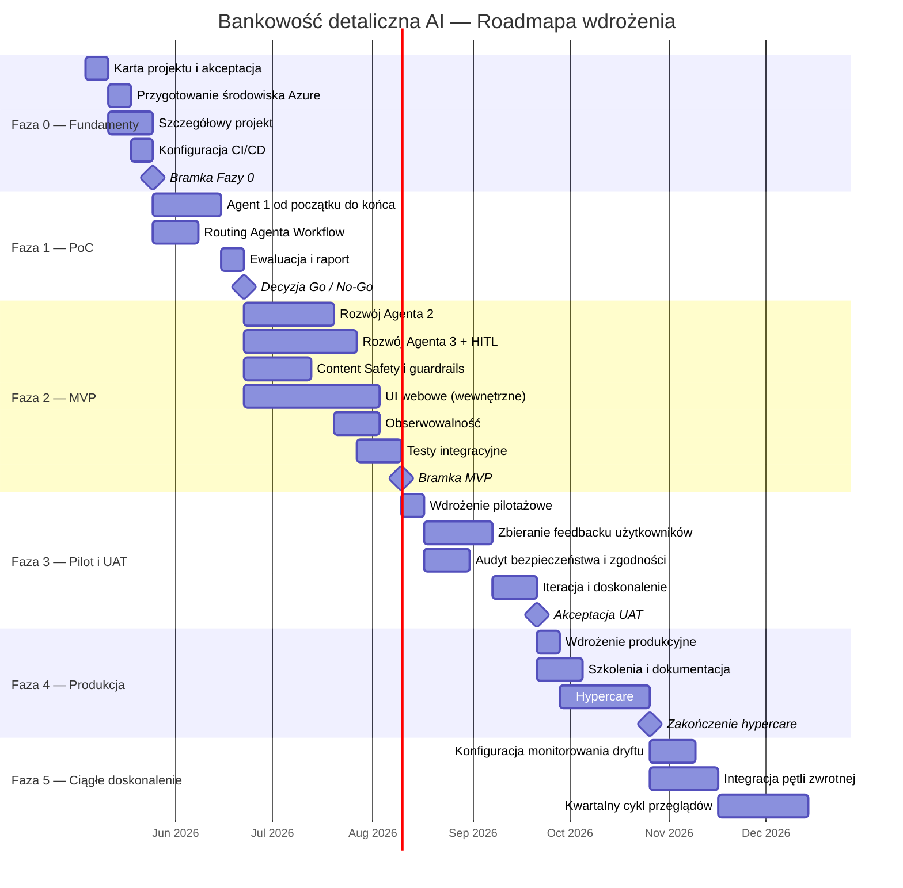

# Roadmapa wdrożenia

> **Status:** Wersja robocza — struktura wysokopoziomowa  
> **Język:** Polski  
> **Zsynchronizowano z:** `implementation_roadmap_EN.md`

---

## 1. Streszczenie

Zwięzły przegląd planu wdrożenia wieloagentowego rozwiązania AI dla bankowości detalicznej opartego na Microsoft Foundry (Azure AI Foundry). Sekcja przedstawia ogólne podejście, kluczowe kamienie milowe, zaangażowanie zasobów oraz oczekiwany zwrot z inwestycji — umożliwiając interesariuszom na poziomie zarządczym szybkie zrozumienie zakresu, tempa i profilu finansowego inicjatywy.

### 1.1 Opis banku i analiza sytuacji

Podrozdział definiuje kontekst biznesowy i operacyjny banku detalicznego, który uzasadnia wdrożenie rozwiązania AI. Łączy perspektywę rynkową z celami na 12 miesięcy oraz wskazuje luki pomiędzy stanem obecnym i docelowym.

#### 1.1.1 Kontekst rynkowy i model

Rynek bankowości detalicznej charakteryzuje się rosnącym popytem na obsługę cyfrową, personalizację ofert oraz skrócenie czasu realizacji procesów (w szczególności kredytowych). Konkurencja obejmuje zarówno banki tradycyjne modernizujące kanały online, jak i fintechy oferujące szybkie, niskotarciowe doświadczenie użytkownika.

Kanały obsługi i sprzedaży obejmują aplikację mobilną, bankowość internetową, contact center oraz oddziały. Docelowa propozycja wartości opiera się na połączeniu zaufania instytucji bankowej z szybkością i trafnością rekomendacji wspieranych przez AI.

Model przychodowy obejmuje przychody odsetkowe, prowizyjne i sprzedaż produktów dodatkowych (cross-sell/up-sell). Kluczowe koszty operacyjne to obsługa klienta, przetwarzanie procesów kredytowych, utrzymanie systemów IT oraz koszty zgodności i zarządzania ryzykiem.

#### 1.1.2 Cele OKR/SMART na 12 miesięcy

Najważniejsze cele obejmują wzrost, retencję i efektywność operacyjną. Cele mają charakter SMART i są przypisane do właścicieli biznesowych oraz technicznych.

| Obszar | Cel (OKR/SMART) | Wskaźnik (KR/KPI) | Właściciel | Termin |
|-------|------------------|-------------------|-----------|--------|
| Wzrost | Zwiększyć sprzedaż produktów dodatkowych dzięki rekomendacjom AI | +12 % konwersji cross-sell vs. baseline | Product Owner + Lider sprzedaży | Koniec miesiąca 12 |
| Retencja | Poprawić utrzymanie klientów aktywnych cyfrowo | -8 % churn w segmencie cyfrowym | Dyrektor bankowości cyfrowej | Koniec miesiąca 12 |
| Efektywność | Skrócić czas obsługi zapytań produktowych i procesów kredytowych | -30 % średniego czasu obsługi; -25 % czasu cyklu wniosku | Kierownik operacji + Inżynier ML | Koniec miesiąca 12 |

#### 1.1.3 Wyzwanie i okazja

Analiza stanu obecnego (as-is) wskazuje na fragmentację danych, wysoki udział czynności manualnych oraz niespójność doświadczenia klienta pomiędzy kanałami. Stan docelowy (to-be) zakłada zintegrowane, wieloagentowe wsparcie procesów z centralnym orkiestratorem, automatyczną klasyfikacją intencji i kontrolowanym przepływem HITL dla przypadków wysokiego ryzyka.

Kluczowe luki obejmują: ograniczoną personalizację ofert, długi czas przetwarzania dokumentów oraz niewystarczającą obserwowalność jakości odpowiedzi modeli. Priorytety zmian koncentrują się na uruchomieniu szybkich wygranych (automatyzacja najczęstszych zapytań, wstępna rekomendacja produktów, OCR dokumentów kredytowych), a następnie na skalowaniu funkcji o najwyższej wartości biznesowej.

Oczekiwane efekty to poprawa doświadczenia klienta, wzrost produktywności zespołów operacyjnych oraz większa przewidywalność kosztów i jakości dzięki metrykom monitorowanym end-to-end.

---

## 2. Etapy wdrożenia

Wdrożenie jest podzielone na odrębne fazy, z których każda ma jasno określone cele, produkty i kryteria wyjścia. Podejście etapowe redukuje ryzyko poprzez wczesną walidację założeń i możliwość korekty kursu przed zaangażowaniem w pełnoskalowe wdrożenie.

### 2.1 Faza 0 — Fundamenty i planowanie

Ustanawia organizacyjne, techniczne i zarządcze fundamenty wymagane przed rozpoczęciem jakichkolwiek prac rozwojowych. Faza zapewnia, że infrastruktura jest przygotowana, zespół skompletowany, a backlog projektu zdefiniowany.

#### 2.1.1 Cele

- Finalizacja karty projektu i akceptacja interesariuszy.
- Przygotowanie zasobu Azure AI Foundry, projektu Foundry i wspierających usług Azure.
- Onboarding członków zespołu; przypisanie ról i odpowiedzialności.
- Ustanowienie potoków CI/CD, środowisk (dev / staging / prod) i bazowej obserwowalności.
- Opracowanie szczegółowych artefaktów projektowych (specyfikacje potoków danych, szablony promptów, kontrakty integracyjne).

#### 2.1.2 Kluczowe produkty

| # | Produkt | Właściciel | Kryterium wyjścia |
|---|---------|-----------|-------------------|
| 1 | Podpisana karta projektu | Sponsor projektu | Zatwierdzona przez komitet sterujący |
| 2 | Przygotowane środowisko Azure (IaC) | Inżynier platformy | Wszystkie zasoby Foundry dostępne; RBAC skonfigurowany |
| 3 | Szczegółowy dokument projektowy | Architekt AI | Zrecenzowany i zbaselinowany |
| 4 | Potok CI/CD (szkielet) | Inżynier DevOps | Pomyślne budowanie i wdrożenie na dev |
| 5 | Rejestr ryzyk v1 | Kierownik projektu | Zrecenzowany na spotkaniu inauguracyjnym |

#### 2.1.3 Czas trwania

_Szacunkowo: 3–4 tygodnie_

### 2.2 Faza 1 — Proof of Concept (PoC)

Walidacja kluczowych hipotez technicznych zdefiniowanych w dokumencie _Koncepcja i projekt rozwiązania AI_. PoC skupia się na agencie o najwyższym ryzyku (do ustalenia podczas planowania) i demonstruje kompleksową wykonalność w kontrolowanym zakresie.

#### 2.2.1 Cele

- Implementacja jednego agenta od początku do końca (np. Agent 1 — Katalog produktów) z mechanizmem wyszukiwania, generowania i ewaluacji.
- Weryfikacja logiki routingu Agenta Workflow z co najmniej dwoma agentami.
- Benchmarking opóźnień, dokładności i kosztów względem metryk sukcesu PoC.
- Uzyskanie decyzji go / no-go od interesariuszy.

#### 2.2.2 Kluczowe produkty

| # | Produkt | Właściciel | Kryterium wyjścia |
|---|---------|-----------|-------------------|
| 1 | Działający agent PoC (Agent 1 lub agent o najwyższym ryzyku) | Inżynier ML | Spełnia metryki sukcesu z dokumentu Koncepcji §5.2 |
| 2 | Agent Workflow — podstawowy routing | Deweloper AI | Poprawne routowanie do ≥ 2 agentów |
| 3 | Raport ewaluacyjny | Data Scientist | Metryki udokumentowane; wydana rekomendacja |
| 4 | Decyzja Go / No-Go | Komitet sterujący | Formalne zatwierdzenie |

#### 2.2.3 Czas trwania

_Szacunkowo: 4–6 tygodni_

### 2.3 Faza 2 — Rozwój MVP

Budowa Minimalnego Produktu Życiowego (MVP) obejmującego wszystkie trzy wyspecjalizowane agenty, orkiestratora, zabezpieczenia treści i podstawowy interfejs użytkownika. MVP jest skierowany do ograniczonej grupy użytkowników w celu uzyskania wczesnego feedbacku.

#### 2.3.1 Cele

- Rozwój i integracja wszystkich trzech Agentów Promptowych (Katalog produktów, Hiperpersonalizacja, Wniosek kredytowy).
- Implementacja warstwy Content Safety i Guardrails.
- Podłączenie serwerów MCP do źródeł danych CRM, transakcji i produktów.
- Integracja Document Intelligence dla OCR wniosków kredytowych.
- Dostarczenie funkcjonalnego UI (aplikacja webowa) dla wewnętrznych użytkowników pilotażowych.
- Ustanowienie obserwowalności (tracing, dashboardy App Insights).

#### 2.3.2 Kluczowe produkty

| # | Produkt | Właściciel | Kryterium wyjścia |
|---|---------|-----------|-------------------|
| 1 | Agent 1 — Katalog produktów (gotowy produkcyjnie) | Inżynier ML | Dokładność ≥ cel; opóźnienie P95 ≤ 500 ms |
| 2 | Agent 2 — Hiperpersonalizacja | Inżynier ML | Wskaźnik trafności cross-sell ≥ cel |
| 3 | Agent 3 — Wniosek kredytowy + przepływ HITL | Inżynier ML | Kompleksowy przepływ z przeglądem człowieka działa |
| 4 | Agent Workflow — pełny routing i fallback | Deweloper AI | Wszyscy agenci osiągalni; graceful error handling |
| 5 | Warstwa Content Safety | Inżynier bezpieczeństwa | Filtry prompt-injection i PII aktywne |
| 6 | UI webowe (pilot wewnętrzny) | Deweloper front-end | Używalne przez grupę pilotażową; podstawowe UX zwalidowane |
| 7 | Dashboardy obserwowalności | Inżynier DevOps | Ślady i metryki widoczne w App Insights |

#### 2.3.3 Czas trwania

_Szacunkowo: 8–12 tygodni_

### 2.4 Faza 3 — Pilot i Testy Akceptacyjne (UAT)

Wdrożenie MVP do kontrolowanej grupy rzeczywistych użytkowników (pracownicy banku i/lub wybrani klienci) w celu zebrania jakościowego feedbacku, walidacji wartości biznesowej i identyfikacji luk w gotowości produkcyjnej.

#### 2.4.1 Cele

- Onboarding użytkowników pilotażowych (najpierw pracownicy wewnętrzni, potem wybrani klienci).
- Zbieranie ustrukturyzowanego feedbacku poprzez ankiety, wywiady i analitykę użytkowania.
- Przeprowadzenie testów A/B porównujących procesy wspierane przez AI z obecnymi, tam gdzie to możliwe.
- Przeprowadzenie testów penetracyjnych i audytu zgodności.
- Iteracja nad prompt engineeringiem, guardrailsami i UX na podstawie feedbacku.

#### 2.4.2 Kluczowe produkty

| # | Produkt | Właściciel | Kryterium wyjścia |
|---|---------|-----------|-------------------|
| 1 | Wdrożenie pilotażowe (staging → środowisko pilotażowe) | Inżynier DevOps | Stabilne przez ≥ 2 tygodnie z użytkownikami pilotażowymi |
| 2 | Raport z feedbacku użytkowników | Product Owner | ≥ 80 % pozytywna satysfakcja; problemy skategoryzowane |
| 3 | Raport z audytu bezpieczeństwa i zgodności | Inżynier bezpieczeństwa | Brak otwartych ustaleń krytycznych / wysokich |
| 4 | Zoptymalizowane prompty i guardrails v2 | Inżynier ML | Poprawione metryki po iteracji |
| 5 | Akceptacja UAT | Interesariusze biznesowi | Formalna akceptacja |

#### 2.4.3 Czas trwania

_Szacunkowo: 4–6 tygodni_

### 2.5 Faza 4 — Wdrożenie produkcyjne

Przeniesienie zwalidowanego rozwiązania do środowiska produkcyjnego z dostępem dla wszystkich docelowych użytkowników. Faza obejmuje przygotowanie do go-live, migrację danych (jeśli dotyczy), szkolenia i wsparcie hypercare.

#### 2.5.1 Cele

- Wykonanie wdrożenia produkcyjnego ze strategią blue-green lub canary.
- Migracja lub przełączenie połączeń danych z pilotażu na źródła produkcyjne.
- Dostarczenie szkoleń użytkowników końcowych i dokumentacji wewnętrznej.
- Ustanowienie rotacji dyżurów on-call i procedur eskalacji.
- Intensywne monitorowanie KPI w okresie hypercare.

#### 2.5.2 Kluczowe produkty

| # | Produkt | Właściciel | Kryterium wyjścia |
|---|---------|-----------|-------------------|
| 1 | Wdrożenie produkcyjne | Inżynier DevOps | Weryfikacja wdrożenia bez przestoju |
| 2 | Przełączenie połączeń danych | Inżynier danych | Wszyscy agenci czytają ze źródeł produkcyjnych |
| 3 | Materiały szkoleniowe i sesje | Product Owner | Szkolenie dostarczone ≥ 90 % docelowych użytkowników |
| 4 | Runbook i harmonogram dyżurów | DevOps / SRE | Udokumentowane i przećwiczone |
| 5 | Raport zamknięcia hypercare | Kierownik projektu | KPI stabilne przez ≥ 2 tygodnie; brak incydentów P1/P2 |

#### 2.5.3 Czas trwania

_Szacunkowo: 2–4 tygodnie (plus 2–4 tygodnie hypercare)_

### 2.6 Faza 5 — Ciągłe doskonalenie i skalowanie

Faza po uruchomieniu skupiona na monitorowaniu dryftu modelu, rozszerzaniu na nowe przypadki użycia, optymalizacji kosztów i ewolucji rozwiązania na podstawie danych produkcyjnych i feedbacku użytkowników.

#### 2.6.1 Cele

- Ustanowienie automatycznej ewaluacji modelu i detekcji dryftu.
- Implementacja pętli zwrotnych (thumbs-up/down, korekty HITL) w celu poprawy jakości agentów.
- Ewaluacja i onboarding dodatkowych agentów lub funkcjonalności.
- Optymalizacja zużycia tokenów, cachingu i kosztów infrastruktury.
- Okresowa ponowna ocena zgodności.

#### 2.6.2 Kluczowe produkty

| # | Produkt | Właściciel | Kryterium wyjścia |
|---|---------|-----------|-------------------|
| 1 | Potok monitorowania dryftu | Data Scientist | Automatyczne alerty przy degradacji metryk |
| 2 | Integracja pętli zwrotnej | Inżynier ML | Korekty użytkowników trafiają do zestawów ewaluacyjnych |
| 3 | Raport optymalizacji kosztów (kwartalny) | Architekt chmurowy | Rekomendacje do wdrożenia; trend TCO malejący |
| 4 | Aktualizacja roadmapy dla nowych funkcjonalności | Product Owner | Spriorytetyzowany backlog na kolejny kwartał |

#### 2.6.3 Czas trwania

_Ciągłe — cykl przeglądów: kwartalny_

---

## 3. Harmonogram główny

Skonsolidowana oś czasu pokazująca wszystkie fazy, kamienie milowe i kluczowe bramki decyzyjne. Harmonogram zakłada sekwencyjne fazy z określonym nakładaniem się tam, gdzie równoległość jest możliwa.

### 3.1 Wykres Gantta (wysokopoziomowy)

### 3.2 Ścieżka krytyczna

Identyfikuje sekwencję zadań zależnych, która determinuje minimalny czas trwania projektu. Jakiekolwiek opóźnienie na ścieżce krytycznej bezpośrednio wpływa na datę go-live.

| Krok | Zależność | Krytyczny? |
|------|----------|-----------|
| Szczegółowy projekt | Podpisana karta projektu | Tak |
| Agent 1 PoC | Ukończony szczegółowy projekt | Tak |
| Decyzja Go / No-Go | Raport ewaluacyjny PoC | Tak |
| Agent 3 + HITL | Pozytywna decyzja Go / No-Go | Tak |
| Testy integracyjne | Wszyscy agenci opracowani | Tak |
| Akceptacja UAT | Feedback pilotażowy + audyt bezpieczeństwa | Tak |
| Wdrożenie produkcyjne | Akceptacja UAT | Tak |

### 3.3 Podsumowanie kamieni milowych

| # | Kamień milowy | Docelowa data | Decydent |
|---|--------------|--------------|---------|
| M1 | Bramka Fazy 0 — fundamenty gotowe | Koniec tygodnia 4 | Kierownik projektu |
| M2 | Go / No-Go PoC | Koniec tygodnia 10 | Komitet sterujący |
| M3 | Bramka MVP — wszyscy agenci zintegrowani | Koniec tygodnia 22 | Lider techniczny + PO |
| M4 | Akceptacja UAT | Koniec tygodnia 28 | Interesariusze biznesowi |
| M5 | Go-live produkcyjne | Koniec tygodnia 30 | Komitet sterujący |
| M6 | Zakończenie hypercare | Koniec tygodnia 34 | Kierownik projektu |

---

## 4. Zasoby

Sekcja definiuje skład zespołu, wymagania kompetencyjne i zależności zewnętrzne niezbędne do pomyślnej realizacji roadmapy.

### 4.1 Kluczowe role i odpowiedzialności zespołu

| Rola | Liczba osób | Odpowiedzialność | Aktywna w fazach |
|------|------------|-----------------|-----------------|
| Kierownik projektu / Scrum Master | 1 | Planowanie, zarządzanie ryzykiem, komunikacja z interesariuszami | 0–5 |
| Architekt AI / ML | 1 | Decyzje architektoniczne, wybór paradygmatu, przywództwo techniczne | 0–3 |
| Inżynier ML | 2 | Rozwój agentów, prompt engineering, fine-tuning modeli, ewaluacja | 1–5 |
| Inżynier danych | 1 | Potoki danych, rozwój serwerów MCP, jakość danych | 0–4 |
| Inżynier platformy / DevOps | 1 | Przygotowanie Azure, CI/CD, IaC, monitoring | 0–5 |
| Deweloper front-end | 1 | UI webowe, projektowanie i iteracja UX | 2–4 |
| Inżynier bezpieczeństwa / zgodności | 0,5 | Content Safety, obsługa PII, audyt, testy penetracyjne | 0–4 |
| Product Owner | 1 | Priorytetyzacja backlogu, alignment interesariuszy, koordynacja UAT | 0–5 |
| Analityk biznesowy / Ekspert dziedzinowy | 0,5 | Walidacja wymagań, reguły kredytowe, dokładność katalogu produktów | 0–3 |

### 4.2 Macierz kompetencji i potrzeby szkoleniowe

| Obszar kompetencji | Wymagana biegłość | Obecna luka | Plan szkolenia / rekrutacji |
|--------------------|-------------------|-------------|---------------------------|
| Azure AI Foundry (Agent Service, Evaluations) | Zaawansowana | _Do oceny_ | Warsztaty prowadzone przez Microsoft; praktyczny PoC |
| Prompt Engineering (GPT-4o / GPT-4.1) | Zaawansowana | _Do oceny_ | Wewnętrzny knowledge sharing; kursy online |
| Rozwój serwerów MCP | Średniozaawansowana | _Do oceny_ | Nauka z dokumentacji; pair programming |
| Azure AI Search (wektorowe + hybrydowe) | Średniozaawansowana | _Do oceny_ | Ścieżka Microsoft Learn |
| Document Intelligence (OCR) | Podstawowa–średnia | _Do oceny_ | Tutorial dostawcy; eksperymenty PoC |
| Odpowiedzialna AI i Content Safety | Średniozaawansowana | _Do oceny_ | Szkolenie Microsoft Responsible AI |

### 4.3 Zależności zewnętrzne i dostawcy

| Zależność | Dostawca | Charakter | Ryzyko w przypadku opóźnienia |
|-----------|---------|----------|-------------------------------|
| Dostęp i kwoty Azure AI Foundry | Microsoft | Platforma | Blokuje cały rozwój agentów |
| Dostępność modeli GPT-4o / GPT-4.1 | Azure OpenAI | Wnioskowanie modelu | Blokuje cele jakościowe agentów |
| Dostęp do danych CRM i transakcji | Wewnętrzne IT / Zespół danych | Źródło danych | Blokuje rozwój Agenta 2 |
| Specyfikacja silnika reguł kredytowych | Dział ryzyka / zgodności | Reguły biznesowe | Blokuje rozwój Agenta 3 |
| Zatwierdzenie środowiska produkcyjnego | IT Security / Rada Zmian | Zarządzanie | Blokuje wdrożenie Fazy 4 |

### 4.4 Wymagania infrastrukturalne i obliczeniowe

| Zasób | Usługa / SKU | Potrzebny od fazy | Szacunkowy koszt miesięczny |
|-------|-------------|-------------------|---------------------------|
| Projekt Azure AI Foundry | Tier Standard | 0–5 | _Patrz §5 — model kosztowy_ |
| Azure OpenAI (GPT-4o) | Pay-as-you-go tokeny | 1–5 | _Zmienny — patrz §5_ |
| Azure AI Search | Standard S1 | 1–5 | _Patrz §5_ |
| Azure App Service / Container Apps | B2+ / P1v3 | 2–5 | _Patrz §5_ |
| Azure Document Intelligence | S0 | 2–5 | _Patrz §5_ |
| Azure Monitor / App Insights | Pay-as-you-go | 0–5 | _Patrz §5_ |
| Środowiska Dev / Staging / Prod | Osobne grupy zasobów | 0–5 | _Patrz §5_ |

---

## 5. Budżet, TCO i ROI

Sekcja przedstawia analizę finansową inicjatywy, obejmującą inwestycję początkową, bieżące koszty operacyjne oraz oczekiwany zwrot w zdefiniowanym horyzoncie czasowym.

### 5.1 Założenia modelu kosztowego

| Założenie | Wartość | Uzasadnienie |
|-----------|---------|-------------|
| Horyzont planowania | 3 lata | Standardowy okres oceny projektu korporacyjnego |
| Waluta | EUR (lub PLN — _do potwierdzenia_) | Podstawowa waluta operacyjna |
| Szacunek zużycia tokenów | _Do zamodelowania podczas PoC_ | Na podstawie prognozowanego wolumenu zapytań i średniej liczby tokenów |
| Baza użytkowników (Rok 1 → Rok 3) | _Do ustalenia_ | Wdrożenie etapowe; pilot → departament → cały bank |
| Stopa dyskontowa dla NPV | 8 % | Korporacyjny WACC lub hurdle rate |

### 5.2 Całkowity koszt posiadania (TCO)

#### 5.2.1 Koszty jednorazowe (CAPEX / Inwestycja początkowa)

| Kategoria | Pozycja | Szacunkowy koszt | Uwagi |
|-----------|---------|-----------------|-------|
| **Ludzie** | Rozruch zespołu i szkolenia | _Do ustalenia_ | Warsztaty, certyfikaty |
| **Ludzie** | Konsulting zewnętrzny (jeśli dotyczy) | _Do ustalenia_ | Przegląd architektury, audyt bezpieczeństwa |
| **Platforma** | Konfiguracja środowiska Azure (IaC) | _Do ustalenia_ | Jednorazowy wysiłek przygotowania |
| **Platforma** | Budowa potoku CI/CD | _Do ustalenia_ | Narzędzia DevOps, projektowanie potoku |
| **Rozwój** | Rozwój PoC | _Do ustalenia_ | Wysiłek Fazy 1 |
| **Rozwój** | Rozwój MVP | _Do ustalenia_ | Wysiłek Fazy 2 |
| **Rozwój** | Projektowanie i rozwój UI/UX | _Do ustalenia_ | Budowa front-endu |
| **Zgodność** | Audyt bezpieczeństwa i testy penetracyjne | _Do ustalenia_ | Zewnętrzny audytor |
| | **Razem jednorazowe** | **_Do ustalenia_** | |

#### 5.2.2 Koszty cykliczne (OPEX / Roczne)

| Kategoria | Pozycja | Rok 1 | Rok 2 | Rok 3 | Uwagi |
|-----------|---------|-------|-------|-------|-------|
| **Azure Compute** | AI Foundry + App Service | _Do ustalenia_ | _Do ustalenia_ | _Do ustalenia_ | Skaluje się z użyciem |
| **Azure AI** | Zużycie tokenów OpenAI | _Do ustalenia_ | _Do ustalenia_ | _Do ustalenia_ | Największy koszt zmienny |
| **Azure AI** | AI Search (hosting indeksu) | _Do ustalenia_ | _Do ustalenia_ | _Do ustalenia_ | Stały per SKU |
| **Azure AI** | Document Intelligence | _Do ustalenia_ | _Do ustalenia_ | _Do ustalenia_ | Wycena per strona |
| **Azure Infra** | Monitoring, logowanie, storage | _Do ustalenia_ | _Do ustalenia_ | _Do ustalenia_ | |
| **Ludzie** | Bieżące operacje i wsparcie | _Do ustalenia_ | _Do ustalenia_ | _Do ustalenia_ | 1–2 FTE po uruchomieniu |
| **Ludzie** | Ciągłe doskonalenie / ML Ops | _Do ustalenia_ | _Do ustalenia_ | _Do ustalenia_ | Tuning promptów, reakcja na dryft |
| **Licencje** | Narzędzia zewnętrzne (jeśli dotyczy) | _Do ustalenia_ | _Do ustalenia_ | _Do ustalenia_ | |
| | **Razem roczne OPEX** | **_Do ustalenia_** | **_Do ustalenia_** | **_Do ustalenia_** | |

#### 5.2.3 Podsumowanie TCO (3 lata)

| Komponent | Rok 0 (Setup) | Rok 1 | Rok 2 | Rok 3 | Razem 3 lata |
|-----------|---------------|-------|-------|-------|-------------|
| Koszty jednorazowe | _Do ustalenia_ | — | — | — | _Do ustalenia_ |
| Cykliczne OPEX | — | _Do ustalenia_ | _Do ustalenia_ | _Do ustalenia_ | _Do ustalenia_ |
| **Razem** | **_Do ustalenia_** | **_Do ustalenia_** | **_Do ustalenia_** | **_Do ustalenia_** | **_Do ustalenia_** |

### 5.3 Korzyści i czynniki wartości

Skwantyfikowane korzyści, jakie rozwiązanie AI ma wygenerować. Każda korzyść jest powiązana z konkretnym agentem lub funkcjonalnością, co zapewnia identyfikowalność atrybucji wartości.

| # | Korzyść | Agent / Funkcjonalność | Metryka | Szacunkowa roczna wartość | Założenia |
|---|---------|----------------------|---------|--------------------------|-----------|
| B1 | Skrócenie czasu obsługi zapytań produktowych | Agent 1 — Katalog produktów | Redukcja średniego czasu obsługi | _Do ustalenia_ | _Do ustalenia_ |
| B2 | Wzrost konwersji cross-sell | Agent 2 — Hiperpersonalizacja | Wzrost wskaźnika konwersji | _Do ustalenia_ | _Do ustalenia_ |
| B3 | Szybsze przetwarzanie wniosków kredytowych | Agent 3 — Wniosek kredytowy | Redukcja czasu cyklu | _Do ustalenia_ | _Do ustalenia_ |
| B4 | Uniknięcie kosztów — ręczny przegląd dokumentów | Agent 3 — OCR + silnik reguł | Zaoszczędzone godziny FTE | _Do ustalenia_ | _Do ustalenia_ |
| B5 | Poprawa satysfakcji klienta (NPS) | Wszyscy agenci | Wzrost NPS | _Do ustalenia_ | Pośrednie — trudniejsze do skwantyfikowania |
| B6 | Redukcja ryzyka regulacyjnego | Content Safety + Guardrails | Wartość unikniętych incydentów | _Do ustalenia_ | Na podstawie benchmarków branżowych |

### 5.4 Zwrot z inwestycji (ROI)

#### 5.4.1 Kalkulacja ROI

$$
\text{ROI} = \frac{\text{Korzyści netto (3 lata)} - \text{TCO (3 lata)}}{\text{TCO (3 lata)}} \times 100\%
$$

| Scenariusz | TCO 3 lata | Korzyści 3 lata | Wartość netto | ROI |
|------------|-----------|----------------|---------------|-----|
| Konserwatywny | _Do ustalenia_ | _Do ustalenia_ | _Do ustalenia_ | _Do ustalenia_ |
| Bazowy | _Do ustalenia_ | _Do ustalenia_ | _Do ustalenia_ | _Do ustalenia_ |
| Optymistyczny | _Do ustalenia_ | _Do ustalenia_ | _Do ustalenia_ | _Do ustalenia_ |

#### 5.4.2 Okres zwrotu

Oczekiwana liczba miesięcy od go-live do momentu, gdy skumulowane korzyści przekroczą skumulowane koszty.

| Scenariusz | Okres zwrotu |
|------------|-------------|
| Konserwatywny | _Do ustalenia_ miesięcy |
| Bazowy | _Do ustalenia_ miesięcy |
| Optymistyczny | _Do ustalenia_ miesięcy |

#### 5.4.3 Wartość bieżąca netto (NPV)

$$
\text{NPV} = \sum_{t=0}^{3} \frac{CF_t}{(1 + r)^t}
$$

gdzie $CF_t$ = przepływ pieniężny netto w roku $t$, a $r$ = stopa dyskontowa.

| Scenariusz | NPV |
|------------|-----|
| Konserwatywny | _Do ustalenia_ |
| Bazowy | _Do ustalenia_ |
| Optymistyczny | _Do ustalenia_ |

### 5.5 Analiza wrażliwości

Identyfikuje zmienne mające największy wpływ na ROI i NPV, pomagając interesariuszom zrozumieć profil ryzyka finansowego.

| Zmienna | Testowany zakres | Wpływ na ROI | Wpływ na NPV |
|---------|-----------------|--------------|--------------|
| Koszt zużycia tokenów (±30 %) | _Do ustalenia_ | _Do ustalenia_ | _Do ustalenia_ |
| Wskaźnik adopcji użytkowników (±20 %) | _Do ustalenia_ | _Do ustalenia_ | _Do ustalenia_ |
| Wzrost konwersji cross-sell (±50 %) | _Do ustalenia_ | _Do ustalenia_ | _Do ustalenia_ |
| Odchylenie kosztów osobowych (±15 %) | _Do ustalenia_ | _Do ustalenia_ | _Do ustalenia_ |

---

## 6. Zarządzanie projektem i ryzykiem

### 6.1 Struktura zarządzania projektem

| Forum | Częstotliwość | Uczestnicy | Cel |
|-------|-------------|-----------|-----|
| Daily Stand-up | Codziennie | Zespół główny | Postępy, blokery, koordynacja |
| Sprint Review / Demo | Co 2 tygodnie | Zespół główny + PO | Przegląd przyrostu, feedback |
| Komitet Sterujący | Miesięcznie | Sponsorzy, PO, PM, Architekt | Decyzje strategiczne, budżet, eskalacje |
| Rada Przeglądu Architektury | W razie potrzeby | Architekt, Bezpieczeństwo, DevOps | Decyzje projektowe, wymagania niefunkcjonalne |

### 6.2 Zarządzanie zmianami

Opisuje proces obsługi zmian zakresu, korekt budżetowych i przesunięć harmonogramu — w tym kto może zatwierdzać zmiany na każdym poziomie.

### 6.3 Kluczowe ryzyka i mitygacje (specyficzne dla roadmapy)

| # | Ryzyko | Wpływ | Prawdopodobieństwo | Mitygacja |
|---|--------|-------|-------------------|----------|
| R1 | Opóźnienia w uzyskaniu kwot Azure AI Foundry | Wysoki | Średnie | Wczesne złożenie wniosku o kwoty; fallback na alternatywny region |
| R2 | Blokada dostępu do danych przez wewnętrzne IT | Wysoki | Średnie | Zaangażowanie zespołu data governance w Fazie 0; formalna umowa o udostępnianiu danych |
| R3 | PoC nie spełnia metryk sukcesu | Wysoki | Niskie–średnie | Iteracja promptów/wyszukiwania; rozważenie zmiany paradygmatu (patrz dok. Koncepcji §2) |
| R4 | Odejście kluczowego członka zespołu | Średni | Niskie | Cross-training; udokumentowana baza wiedzy |
| R5 | Koszty tokenów przekraczają budżet | Średni | Średnie | Implementacja budżetów tokenowych, caching, optymalizacja rozmiaru modelu (GPT-4.1-mini) |
| R6 | Zmiana wymogów regulacyjnych w trakcie projektu | Średni | Niskie | Regularne przeglądy zgodności; modularna architektura umożliwia adaptację |
| R7 | Niska adopcja użytkowników po uruchomieniu | Wysoki | Niskie–średnie | Wczesne zaangażowanie pilotażowe; zarządzanie zmianą; iteracja UX |

---

## 7. Kryteria sukcesu i KPI

Definiuje, jak ogólne wdrożenie będzie oceniane jako udane, niezależnie od indywidualnych metryk PoC.

| KPI | Cel | Metoda pomiaru | Częstotliwość przeglądu |
|-----|-----|---------------|------------------------|
| Terminowość dostaw (osiągnięte kamienie milowe) | ≥ 80 % kamieni milowych w terminie | Gantt vs. rzeczywistość | Miesięcznie |
| Odchylenie budżetowe | ≤ 10 % powyżej budżetu | Rzeczywiste vs. plan | Miesięcznie |
| Satysfakcja użytkowników (pilot) | ≥ 4,0 / 5,0 | Ankieta | Koniec Fazy 3 |
| Dokładność agentów (produkcja) | Zgodnie z celami z dok. Koncepcji §5.2 | Automatyczna ewaluacja | Co tydzień |
| Dostępność systemu | ≥ 99,5 % | Azure Monitor | Miesięcznie |
| Średni czas rozwiązania (P1/P2) | ≤ 4 godziny | Śledzenie incydentów | Miesięcznie |
| Realizacja ROI (Rok 1) | ≥ Prognoza scenariusza bazowego | Raport finansowy | Rocznie |

---

## 8. Kolejne kroki

Natychmiastowe działania w celu uruchomienia realizacji roadmapy.

### 8.1 Działania natychmiastowe

1. Uzyskanie zatwierdzenia roadmapy przez komitet sterujący.
2. Potwierdzenie obsady zespołu i dat onboardingu.
3. Złożenie wniosków o kwoty i dostęp do Azure AI Foundry.
4. Zaplanowanie warsztatów szczegółowego projektowania (kick-off Fazy 0).
5. Ustanowienie backlogu projektu w wybranym narzędziu do zarządzania projektami.

### 8.2 Otwarte decyzje

| # | Decyzja | Wymagana do | Decydent | Termin |
|---|---------|------------|---------|--------|
| D1 | Finalna waluta budżetu (EUR vs. PLN) | Faza 0 | Finanse / Sponsor | _Do ustalenia_ |
| D2 | Build vs. buy dla UI front-end | Faza 0 | Architekt + PO | _Do ustalenia_ |
| D3 | Strategia wyszukiwania Agenta 1 (MCP vs. File Search) | Faza 1 | Architekt | Koniec PoC |
| D4 | Model hostingu produkcyjnego (App Service vs. Container Apps) | Faza 2 | Inżynier platformy | _Do ustalenia_ |

---

_Wersja dokumentu: 0.1 — struktura wysokopoziomowa_
